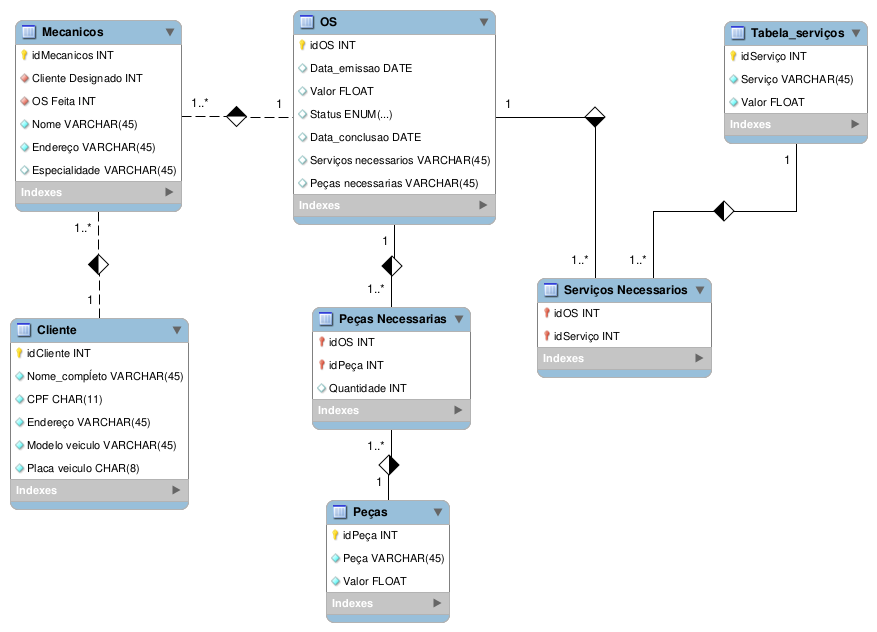

# Oficina MySQL
### Banco de dados simples para uma oficina feito em SQL utilizando MySQL
Projeto para formação no bootcamp [**Potência Tech powered by iFood | ciência de Dados com Python**](https://www.dio.me/bootcamp/potencia-tech-powered-ifood-ciencias-de-dados-com-python)

Foram adicionados alguns dados ficticios a fim de testes.

